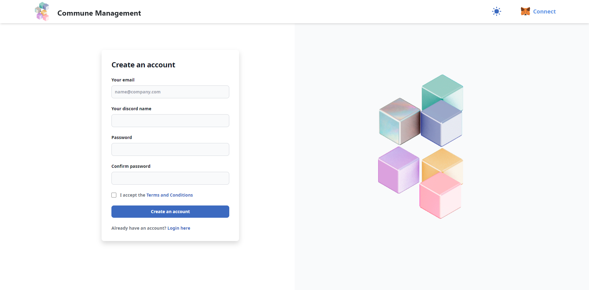
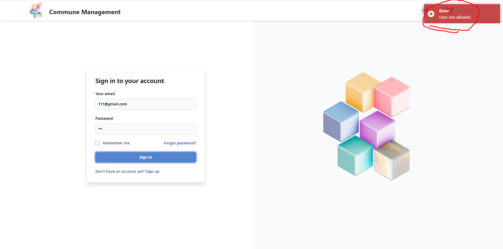
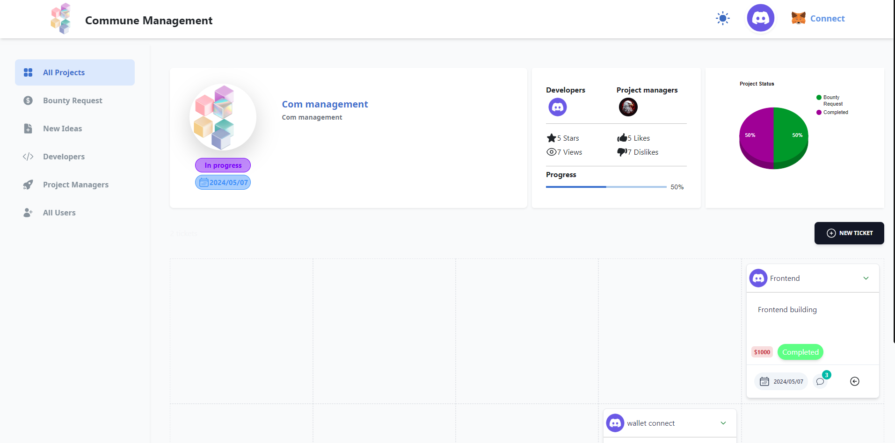

<div position="absolute" align="center">
<h1 style=""> Commune Project Management </h1>
</div>

## About
**A web application with a backend in Node.js and frontend in [React](https://reactjs.org) to
manage projects of CommuneAI**
 
## Roles
- **Developer**
- **Project Manager**
- **Admin**

**At first when you sign up, you don't have any roles, you can't login until the Admin gives you a role, only admin can give you developer or project manager role.**

**After you have a role, you can sign in your account and start your working.**

**If you have developer role, you can propose to the projects what you want and also suggest new ideas then after admin agrees, can start working on project**

**If you have project manager role, you can manage tickets - (create and review) for projects that you are managing**

**Admin can create and delete projects, can manage all projects, can accept new proposals from developers, can set and remove the developers and project managers for each projects and also can manage tickets.**
 
## Signin

**At first you have to signup your account with your Email, Discord name and password**



**You can't login untill the Admin gives you a role. You have to wait**



**Admin can see all users who signed up on the sidebar and can give them a role so that users can login and start work**

https://github.com/potter1990po/Com-management/assets/154459049/942e7774-479e-4966-ab14-323140bfbff6


## Usage
 - For developers
    - **You can see all projects via All Project tag on Sidebar and propose to the projects what you want to work on**
    - **You can also see the projects that you are working on via My Project tag on Sidebar and see the status of the project.**
    - **You can work on your project with tickets. If the project started, you can work on tickets and after you finish one ticket, you have to move the ticket to the review step. Additionally you have to set Git repo and demo site url on the tickets**

 - For Project Managers
    - **You can see all projects via All Project tag on Sidebar and propose to the projects what you want to manage**
    - **You can also see the projects that you are managing via My Project tag on Sidebar and see the status of the project.**
    - **You can manage tickets of your projects. If the project started, you can create tickets with title and description and can review the following tickets that the devs completed and after that you have to move it to bounty request step.**

 - For Admin
    - **You can see all projects via All Project tag on Sidebar and create and delete projects and accept new ideas and proposals.**
    - **You have to click Start project button to start the project.**
    - **You can also manage tickets. If you recieve bounty request tickets, you can check them and have to move them to the complete step.**
    - **You can control the roles of the users. You can give developer or project manager role to the users and also can remove it**

https://github.com/potter1990po/Com-management/assets/154459049/596a5ffa-59a6-45f0-8c2d-ebe9f8f6cd3e


https://github.com/potter1990po/Com-management/assets/154459049/3059561f-65e8-4cdc-9345-49c34162cc68


## Tickets

  - **You can see ticket page by clicking the title on project card.**

  - **On ticket page you can see the detail of project as well as the progress of all tickets.**

  - **You can also see the progress bar of the project and the status of ticket via chart.**




## Additional Features

  - **Dark mode.**

  - **Wallet connection.**

  - **Avatar File Upload.**

  - **Can see user detail card on hover the user avatar.**

https://github.com/potter1990po/Com-management/assets/154459049/149baf8a-ff9e-45c9-bb66-cfb84971bf05


## Environment Installation 📝

You will need:

- Node v20.11.0
- MongoDB v6.04
 
## Running The App 🖥️

### Run backend

```console
> cd backend
npm install
```

```console
> cd backend
npm start
```

### Run Frontend

```console
npm install --force
```
```console
npm start
```
