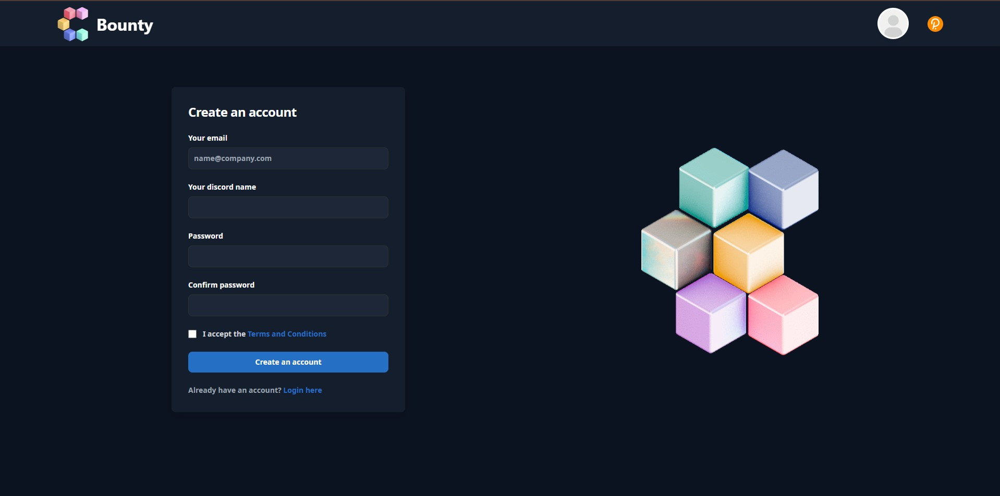
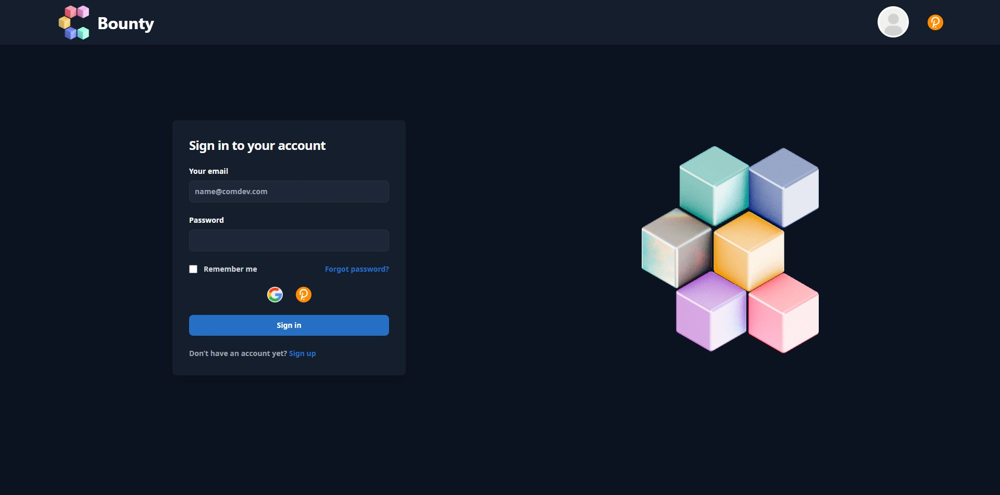
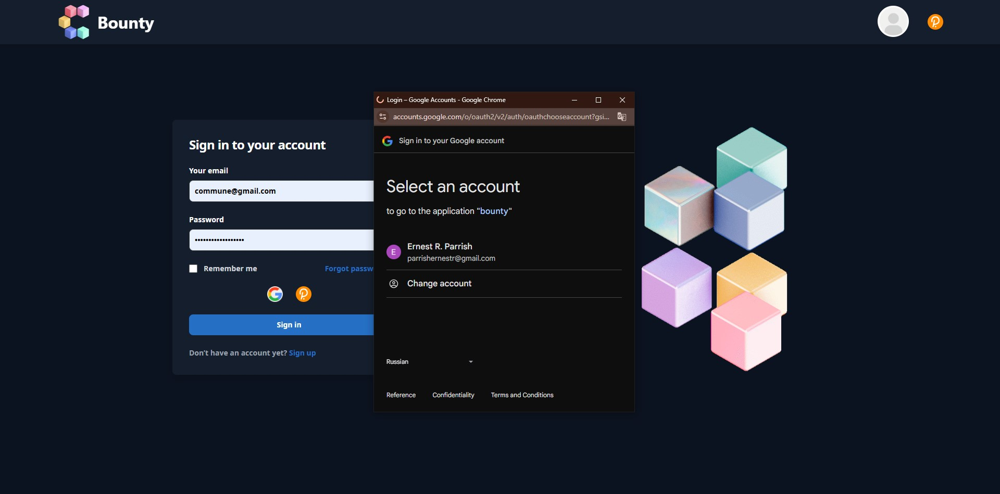
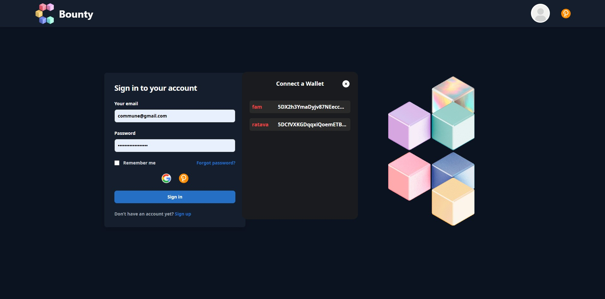
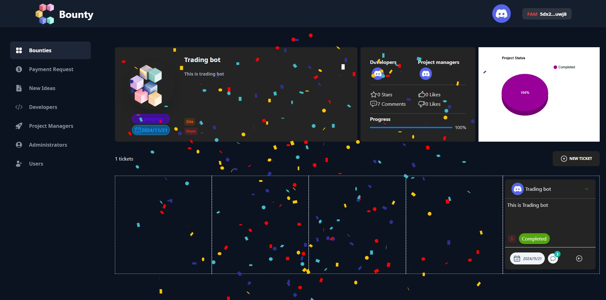

<div position="absolute" align="center">
<h1 style=""> Bounty System </h1>
</div>

## About
**A system that manages bounties by connecting Discord bots and site.**
 
## Roles
- **User**
- **Developer**
- **Project Manager**
- **Admin**

**Users can view all bounties without signing up for the site**

**Users can also view all bounties on Discord.**

**If you have a developer role, you can suggest things you want to the project and start working on the project once the admin agrees.**

**If you have a project manager role, you can manage tickets (create and review) for the projects you manage.**

**Admins can create and delete projects, manage all projects, set and remove developers and project managers for each project, and manage tickets.**

## Register and Login

**Users can register and login for the site using email, google, and polkadot wallet**






## Usage
 - For developers
    - **You can also see the projects that you are working on via My Project tag on Sidebar and see the status of the project.**
    - **You can work on your project with tickets. If the project started, you can work on tickets and after you finish one ticket, you have to move the ticket to the review step. Additionally you have to set Git repo and demo site url on the tickets**

 - For Project Managers
    - **You can see all projects via All Project tag on Sidebar and propose to the projects what you want to manage**
    - **You can also see the projects that you are managing via My Project tag on Sidebar and see the status of the project.**
    - **You can manage tickets of your projects. If the project started, you can create tickets with title and description and can review the following tickets that the devs completed and after that you have to move it to bounty request step.**

 - For Admin
    - **You can see all projects via All Project tag on Sidebar and create and delete projects and accept proposals.**
    - **You have to click Start project button to start the project.**
    - **You can also manage tickets. If you recieve bounty request tickets, you can check them and have to move them to the complete step.**
    - **You can control the roles of the users. You can give developer or project manager role to the users and also can remove it**

## Create Bounty (Website and discord bot)

  - **Admins can create new bounties on the site. This will create the exact same bounty on Discord. Use /jobbot command**

  - **Conversely, on Discord, you can create new bounties using bots, and this will be reflected on the site at the same time.**

  - **People can apply through the website or through the Discord bot.**

https://github.com/user-attachments/assets/112b14cc-ed99-46e7-8b25-1eb46e1373f8

## Tickets

  - **You can see ticket page by clicking the title on project card.**

  - **On ticket page you can see the detail of project as well as the progress of all tickets.**

  - **You can also see the progress bar of the project and the status of ticket via chart.**




## Additional Features

  - **Dark mode.**

  - **Wallet connection.**

  - **Avatar File Upload.**

  - **Can see user detail card on hover the user avatar.**


## Environment Installation 📝

You will need:

- Node v20.11.0
- MongoDB v6.04
- Python 3.12.6
 
TOKEN = 'YOUR_BOT_TOKEN_HERE'

CHANNEL_ID = 'YOUR_DISCORD_CHANNEL_ID_HERE'
## Running The App 🖥️

### Run backend

```console
> cd backend
yarn
```

```console
> cd backend
yarn start
```

### Run Frontend

```console
> cd frontend
yarn
```
```console
> cd frontend
yarn start
```

### Run Discord bot

```console
> cd bot
```
```console
> cd bot
pip install -r requirement.txt
```
```
> cd bot
python bot.py
```
